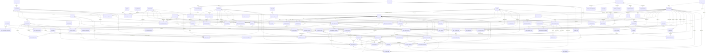

# Physical ERD

Generated from the same FK specification as migration 001. Composite tenant keys are omitted from arrows for readability.

```mermaid
erDiagram
  org_branches ||--o{ org_members : "branch_id"
  org_roles ||--o{ org_role_permissions : "role_id"
  org_permissions ||--o{ org_role_permissions : "permission_id"
  org_trades ||--o{ org_qualifications : "trade_id"
  crm_customers ||--o{ crm_customer_contacts : "customer_id"
  crm_contacts ||--o{ crm_customer_contacts : "contact_id"
  crm_addresses ||--o{ crm_properties : "address_id"
  org_trades ||--o{ crm_equipment_types : "trade_id"
  crm_contacts ||--o{ crm_communication_preferences : "contact_id"
  cat_units ||--o{ cat_materials : "unit_id"
  org_trades ||--o{ cat_services : "trade_id"
  org_trades ||--o{ cat_labor_rates : "trade_id"
  agree_plans ||--o{ agree_plan_versions : "plan_id"
  crm_files ||--o{ agree_plan_versions : "source_file_id"
  integrate_connections ||--o{ integrate_record_mappings : "connection_id"
  integrate_connections ||--o{ integrate_sync_attempts : "connection_id"
  integrate_connections ||--o{ integrate_checkpoints : "connection_id"
  integrate_connections ||--o{ integrate_authority : "connection_id"
  org_members ||--o{ org_member_roles : "member_id"
  org_roles ||--o{ org_member_roles : "role_id"
  org_members ||--o{ org_technicians : "member_id"
  crm_customers ||--o{ crm_customer_properties : "customer_id"
  crm_properties ||--o{ crm_customer_properties : "property_id"
  crm_equipment_types ||--o{ crm_equipment : "type_id"
  crm_properties ||--o{ crm_equipment : "property_id"
  crm_files ||--o{ crm_equipment : "warranty_document_id"
  cat_pricebooks ||--o{ cat_price_versions : "pricebook_id"
  cat_units ||--o{ cat_price_versions : "unit_id"
  cat_materials ||--o{ cat_price_versions : "material_id"
  cat_services ||--o{ cat_price_versions : "service_id"
  cat_services ||--o{ cat_checklist_templates : "service_id"
  cat_services ||--o{ cat_material_requirements : "service_id"
  cat_materials ||--o{ cat_material_requirements : "material_id"
  crm_files ||--o{ import_batches : "source_file_id"
  org_members ||--o{ import_batches : "requested_by"
  agree_plan_versions ||--o{ agree_benefit_definitions : "plan_version_id"
  cat_services ||--o{ agree_benefit_definitions : "service_id"
  crm_customers ||--o{ agree_agreements : "customer_id"
  agree_plan_versions ||--o{ agree_agreements : "plan_version_id"
  crm_files ||--o{ agree_agreements : "source_file_id"
  org_members ||--o{ agree_agreements : "interpretation_reviewer_id"
  crm_customers ||--o{ job_jobs : "billing_customer_id"
  crm_properties ||--o{ job_jobs : "property_id"
  org_branches ||--o{ job_jobs : "branch_id"
  cat_job_types ||--o{ job_jobs : "job_type_id"
  inv_suppliers ||--o{ inv_supplier_materials : "supplier_id"
  cat_materials ||--o{ inv_supplier_materials : "material_id"
  org_members ||--o{ ai_runs : "requested_by"
  org_members ||--o{ audit_events : "actor_id"
  org_technicians ||--o{ org_technician_qualifications : "technician_id"
  org_qualifications ||--o{ org_technician_qualifications : "qualification_id"
  crm_equipment ||--o{ crm_equipment_history : "equipment_id"
  crm_properties ||--o{ crm_equipment_history : "from_property_id"
  crm_properties ||--o{ crm_equipment_history : "to_property_id"
  crm_equipment ||--o{ crm_equipment_history : "replacement_equipment_id"
  crm_files ||--o{ crm_equipment_history : "evidence_id"
  org_members ||--o{ crm_notes : "author_id"
  crm_customers ||--o{ crm_notes : "customer_id"
  crm_properties ||--o{ crm_notes : "property_id"
  crm_equipment ||--o{ crm_notes : "equipment_id"
  crm_files ||--o{ crm_notes : "attachment_id"
  cat_checklist_templates ||--o{ cat_checklist_items : "template_id"
  import_batches ||--o{ import_field_mappings : "batch_id"
  import_batches ||--o{ import_staging_records : "batch_id"
  agree_agreements ||--o{ agree_coverage : "agreement_id"
  crm_properties ||--o{ agree_coverage : "property_id"
  crm_equipment ||--o{ agree_coverage : "equipment_id"
  org_trades ||--o{ agree_coverage : "trade_id"
  cat_services ||--o{ agree_coverage : "service_id"
  agree_agreements ||--o{ agree_changes : "agreement_id"
  org_members ||--o{ agree_changes : "approved_by"
  agree_agreements ||--o{ agree_changes : "renewal_agreement_id"
  job_jobs ||--o{ job_trades : "job_id"
  org_trades ||--o{ job_trades : "trade_id"
  job_jobs ||--o{ job_equipment : "job_id"
  crm_equipment ||--o{ job_equipment : "equipment_id"
  job_jobs ||--o{ job_tasks : "job_id"
  cat_services ||--o{ job_tasks : "service_id"
  cat_checklist_templates ||--o{ job_tasks : "checklist_template_id"
  job_jobs ||--o{ job_appointments : "job_id"
  org_technicians ||--o{ job_availability : "technician_id"
  job_jobs ||--o{ job_time_entries : "job_id"
  org_technicians ||--o{ job_time_entries : "technician_id"
  org_members ||--o{ job_time_entries : "approved_by"
  job_jobs ||--o{ job_status_history : "job_id"
  org_members ||--o{ job_status_history : "actor_id"
  job_jobs ||--o{ job_return_links : "original_job_id"
  job_jobs ||--o{ job_return_links : "return_job_id"
  job_jobs ||--o{ job_required_materials : "job_id"
  cat_materials ||--o{ job_required_materials : "material_id"
  job_jobs ||--o{ job_readiness_checks : "job_id"
  cat_materials ||--o{ job_readiness_checks : "material_id"
  crm_files ||--o{ job_readiness_checks : "evidence_file_id"
  org_branches ||--o{ inv_locations : "branch_id"
  org_technicians ||--o{ inv_locations : "technician_id"
  crm_customers ||--o{ bill_quotes : "customer_id"
  crm_properties ||--o{ bill_quotes : "property_id"
  job_jobs ||--o{ bill_quotes : "job_id"
  agree_agreements ||--o{ bill_membership_schedules : "agreement_id"
  ai_runs ||--o{ ai_extracted_terms : "run_id"
  crm_files ||--o{ ai_extracted_terms : "source_file_id"
  ai_runs ||--o{ ai_change_sets : "run_id"
  org_members ||--o{ follow_tasks : "assigned_to"
  crm_customers ||--o{ follow_tasks : "customer_id"
  job_jobs ||--o{ follow_tasks : "job_id"
  import_staging_records ||--o{ import_validation_issues : "record_id"
  import_staging_records ||--o{ import_duplicate_candidates : "record_id"
  import_staging_records ||--o{ import_decisions : "record_id"
  org_members ||--o{ import_decisions : "reviewer_id"
  agree_agreements ||--o{ agree_benefit_accounts : "agreement_id"
  agree_benefit_definitions ||--o{ agree_benefit_accounts : "benefit_definition_id"
  import_staging_records ||--o{ agree_benefit_accounts : "source_record_id"
  job_appointments ||--o{ job_assignments : "appointment_id"
  org_technicians ||--o{ job_assignments : "technician_id"
  job_jobs ||--o{ job_confirmed_work : "job_id"
  job_tasks ||--o{ job_confirmed_work : "task_id"
  cat_services ||--o{ job_confirmed_work : "service_id"
  cat_units ||--o{ job_confirmed_work : "unit_id"
  org_members ||--o{ job_confirmed_work : "confirmed_by"
  inv_locations ||--o{ inv_stock_accounts : "location_id"
  cat_materials ||--o{ inv_stock_accounts : "material_id"
  bill_quotes ||--o{ bill_quote_lines : "quote_id"
  cat_units ||--o{ bill_quote_lines : "unit_id"
  cat_services ||--o{ bill_quote_lines : "service_id"
  cat_materials ||--o{ bill_quote_lines : "material_id"
  cat_price_versions ||--o{ bill_quote_lines : "price_version_id"
  cat_labor_rates ||--o{ bill_quote_lines : "labor_rate_id"
  bill_quotes ||--o{ bill_accepted_scopes : "quote_id"
  org_members ||--o{ bill_accepted_scopes : "recorded_by"
  crm_files ||--o{ bill_accepted_scopes : "evidence_id"
  ai_change_sets ||--o{ ai_actions : "change_set_id"
  ai_extracted_terms ||--o{ ai_actions : "evidence_term_id"
  ai_change_sets ||--o{ ai_decisions : "change_set_id"
  org_members ||--o{ ai_decisions : "reviewer_id"
  crm_contacts ||--o{ follow_message_drafts : "contact_id"
  org_members ||--o{ follow_message_drafts : "created_by"
  follow_tasks ||--o{ follow_message_drafts : "task_id"
  org_members ||--o{ follow_message_drafts : "approved_by"
  import_staging_records ||--o{ import_outcomes : "record_id"
  import_decisions ||--o{ import_outcomes : "decision_id"
  job_confirmed_work ||--o{ job_work_evidence : "work_id"
  crm_files ||--o{ job_work_evidence : "file_id"
  agree_benefit_accounts ||--o{ agree_benefit_ledger : "account_id"
  job_jobs ||--o{ agree_benefit_ledger : "job_id"
  job_confirmed_work ||--o{ agree_benefit_ledger : "work_id"
  import_staging_records ||--o{ agree_benefit_ledger : "source_record_id"
  agree_benefit_ledger ||--o{ agree_benefit_ledger : "reverses_id"
  org_members ||--o{ agree_benefit_ledger : "approved_by"
  agree_agreements ||--o{ agree_planned_visits : "agreement_id"
  crm_properties ||--o{ agree_planned_visits : "property_id"
  cat_services ||--o{ agree_planned_visits : "service_id"
  job_jobs ||--o{ agree_planned_visits : "job_id"
  job_confirmed_work ||--o{ agree_planned_visits : "completed_work_id"
  cat_materials ||--o{ inv_movements : "material_id"
  inv_stock_accounts ||--o{ inv_movements : "from_account_id"
  inv_stock_accounts ||--o{ inv_movements : "to_account_id"
  job_jobs ||--o{ inv_movements : "job_id"
  job_confirmed_work ||--o{ inv_movements : "work_id"
  import_staging_records ||--o{ inv_movements : "source_record_id"
  inv_movements ||--o{ inv_movements : "reverses_id"
  org_members ||--o{ inv_movements : "approved_by"
  inv_stock_accounts ||--o{ inv_replenishment_policies : "account_id"
  inv_suppliers ||--o{ inv_replenishment_policies : "preferred_supplier_id"
  crm_customers ||--o{ bill_invoices : "billing_customer_id"
  job_jobs ||--o{ bill_invoices : "job_id"
  bill_accepted_scopes ||--o{ bill_invoices : "accepted_scope_id"
  ai_actions ||--o{ ai_execution_outcomes : "action_id"
  ai_decisions ||--o{ ai_execution_outcomes : "decision_id"
  follow_message_drafts ||--o{ follow_delivery_attempts : "draft_id"
  agree_benefit_accounts ||--o{ agree_benefit_reservations : "account_id"
  job_jobs ||--o{ agree_benefit_reservations : "job_id"
  agree_benefit_ledger ||--o{ agree_benefit_reservations : "consumption_entry_id"
  inv_stock_accounts ||--o{ inv_reservations : "account_id"
  job_jobs ||--o{ inv_reservations : "job_id"
  inv_movements ||--o{ inv_reservations : "consumption_movement_id"
  bill_invoices ||--o{ bill_invoice_lines : "invoice_id"
  cat_units ||--o{ bill_invoice_lines : "unit_id"
  cat_services ||--o{ bill_invoice_lines : "service_id"
  cat_materials ||--o{ bill_invoice_lines : "material_id"
  cat_price_versions ||--o{ bill_invoice_lines : "price_version_id"
  cat_labor_rates ||--o{ bill_invoice_lines : "labor_rate_id"
  job_confirmed_work ||--o{ bill_invoice_lines : "work_id"
  agree_benefit_ledger ||--o{ bill_invoice_lines : "benefit_entry_id"
  bill_invoices ||--o{ bill_issued_snapshots : "invoice_id"
  org_members ||--o{ bill_issued_snapshots : "issued_by"
  job_jobs ||--o{ report_events : "job_id"
  inv_movements ||--o{ report_events : "movement_id"
  bill_invoices ||--o{ report_events : "invoice_id"
  bill_invoices ||--o{ bill_review_flags : "invoice_id"
  bill_invoice_lines ||--o{ bill_review_flags : "line_id"
  crm_files ||--o{ bill_review_flags : "evidence_file_id"
  job_confirmed_work ||--o{ bill_review_flags : "evidence_work_id"
  org_members ||--o{ bill_review_flags : "reviewer_id"
  bill_issued_snapshots ||--o{ bill_corrections : "issued_snapshot_id"
  org_members ||--o{ bill_corrections : "approved_by"
```
